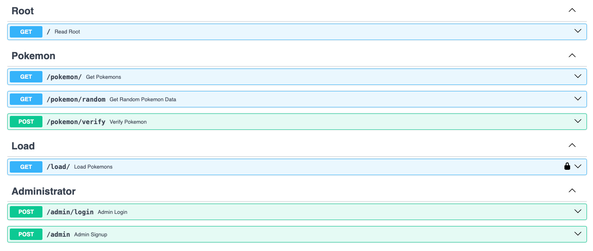

# FastAPI and MongoDB Boilerplate

Python FastAPI backend API to retrieve pokemon information

## Features

+ Python FastAPI backend.
+ MongoDB database.
+ Authentication
+ Deployment

Application exposes many endpoints: swagger specification can be found at `/docs`

## Prerequisites

Before you begin, ensure you have the following installed on your machine:

- [Python 3](https://www.python.org): Ensure that Python, preferably version 3.9 or higher, is installed on your system, as this project utilizes the latest versions of TypeScript and Nodemon.
- [Docker](https://www.docker.com/): Docker: Accelerated Container Application Development.

## Using the applicaiton

To use the application, follow the outlined steps:

1. Clone this repository and create a virtual environment in it:

```console
$ python3 -m venv venv
```

2. Install the modules listed in the `requirements.txt` file:

```console
(venv)$ pip3 install -r requirements.txt
```
3. You also need to start your mongodb instance either locally or on Docker as well as create a `.env.dev` file. See the `.env.sample` for configurations. 

    Example for running locally MongoDB at port 27017:
    ```console
    cp .env.sample .env.dev
    ```

4. Start the application:

```console
python3 main.py
```


The starter listens on port 8000 on address [0.0.0.0](0.0.0.0:8080). 




## Testing

To run the tests, run the following command:

```console
(venv)$ pytest
```

You can also write your own tests in the `tests` directory.  
The test follow by the official support [FastAPI testing guide](https://fastapi.tiangolo.com/tutorial/testing/), [pytest](https://docs.pytest.org/en/stable/), [anyio](https://anyio.readthedocs.io/en/stable/) for async testing application.

## Deployment

This application can be deployed on any PaaS such as [AWS](https://aws.amazon.com).

## License

This project is licensed under the terms of MIT license.
